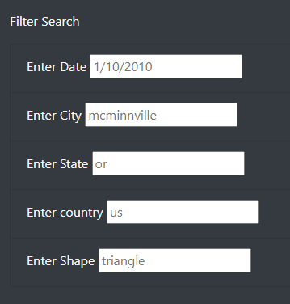
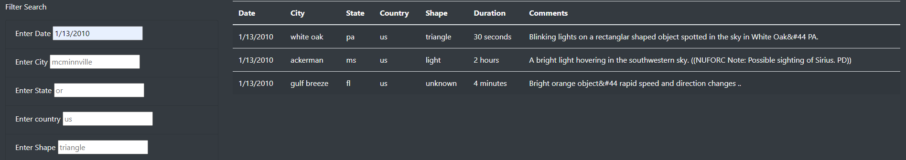
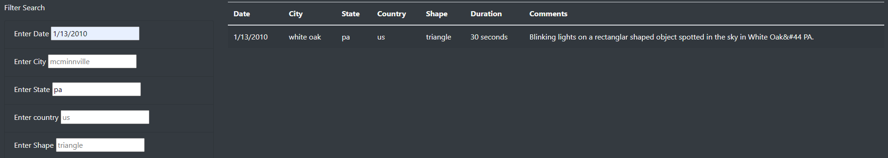
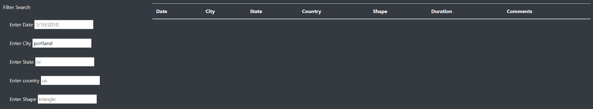
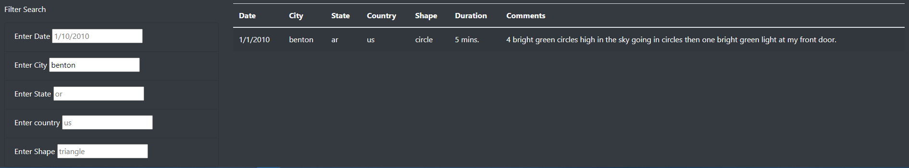
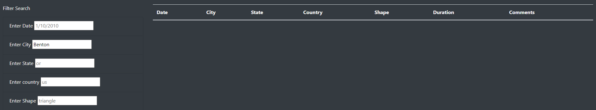

# UFOs

## Overview
This project was to create an interactive website that allows the user to filter UFO sighting data.

I used JavaScript to build functions that would build and filter a table that included the sighting data. The filter function included multiple filters (date, city, state, country, and shape of the UFO sighting) and utilized the D3 library to filter whenever a change occurred in the filter input box.

HTML and CSS were used to create and style the website where the table was presented. I used Bootstrap for styling elements such as a Jumbotron, Navbar, and responsive containers that adjust depending on device width.

## Results

The webpage displays a table that includes UFO sighting data, including the date, city, state, and country the sighting occurred in, as well as the shape and duration of the event, and any additional comments. Per the following image, the page allows you to filter the table based on date, city, state, country, or shape of the sighting. When the filters are blank, the user is presented with the entire data set:

Each filter has example text in the input box to show the user the format they need to enter for the filter to work. In the following image, the table has been filtered to only include UFO sightings for the date of "1/13/2010":

The user is also able to filter on multiple criteria at the same time. The following image shows when the table is filtered on both date ("1/13/2010") and state ("pa"):

When there are no matches for data, an empty table is shown (as seen here when searching for UFO sightings in "portland"):

The table can be reset by either emptying all of the filter input boxes, refreshing the page, or clicking the "UFO Sightings" text in the navbar (above the title banner):

## Summary
 This filtering system seems to work well, although one drawback is that the input boxes need exact text matches to filter the table. For instance, if you search for "benton" in the city filter, you get the following match:
 

 However, if you search for "Benton", you don't get any matches:
 

 A fix for this would be to loosen the strictness for text matches in the code.

 Similarly, it could be difficult to search based on shape unless you are familiar with common names for UFO sighting shapes (i.e. I would not know to search for "cigar", "changing", or "fireball" to name a few of the options). Including a dropdown menu for users to select from, that pulls from what is included in the data, may make this filter easier to use for the user.
